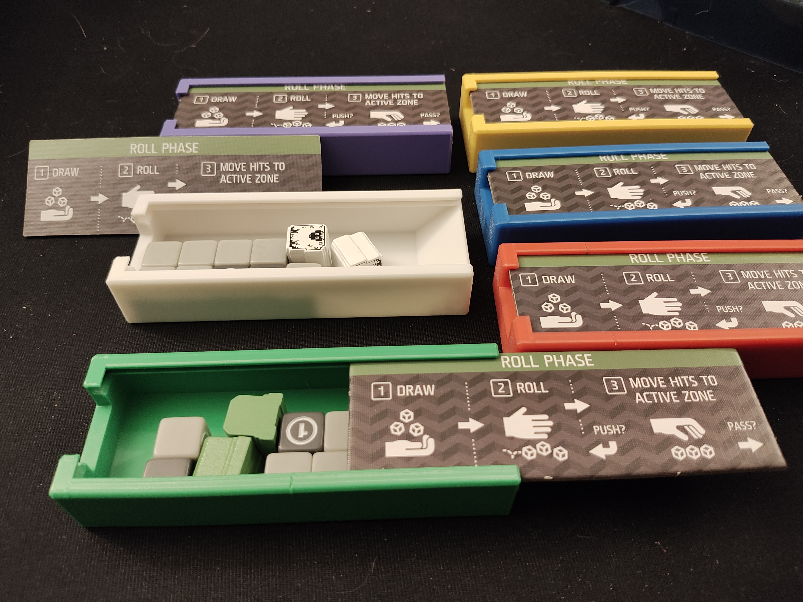
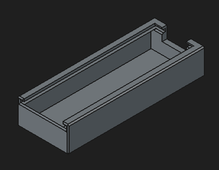
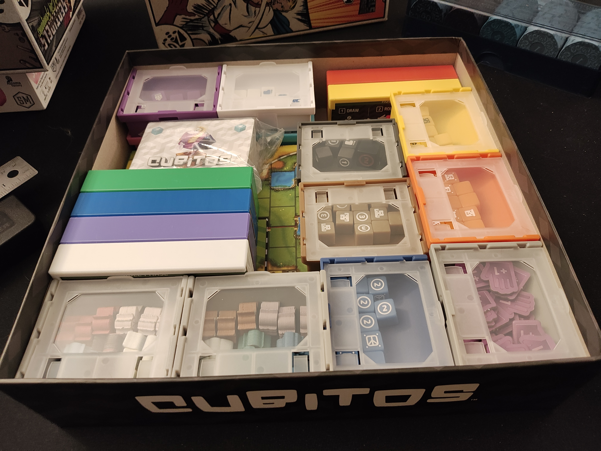

# Cubitos Player Tray

- [Cubitos Player Tray](#cubitos-player-tray)
	- [About](#about)
	- [Files](#files)
	- [Printing](#printing)
	- [More pics](#more-pics)
- [Donations](#donations)
- [License](#license)

## About

Holds all the pieces for a player in Cubitos, using the phase tile as a lid! The tile is held in place firmly but gently, and won't budge even when shaken vigorously. A finger notch makes it easy to push the token back out.

## Files

- [cubitos-player-tray.FCStd](./cubitos-player-tray.FCStd) - FreeCAD file of the design
- [cubitos-player-tray.stl](./cubitos-player-tray.stl) - Ready-to-print STL

## Printing

Prints w/o supports. I printed in PETG, but should be fine in PLA.

## More pics

# Donations

I don't do this for money. I do this for the joy of creation. No donations are necessary or expected.

That said, if you've enjoyed any of my designs or projects and would like to throw me a bone, here are a few options:

- Ko-fi: https://ko-fi.com/asmor
- Bitcoin: `3LAhwsanaWwcjdmzx2FnaLp7rTtgtSBvaG`
- Ethereum: `0x22794106e6D57c1b3A6C9Dd79DF5Ad3b54C9704a`

# License

[This work is licensed under CC BY-NC-SA 4.0](https://creativecommons.org/licenses/by-nc-sa/4.0/)

If you'd like to discuss commercial licensing of any of my designs, please send me a message.
