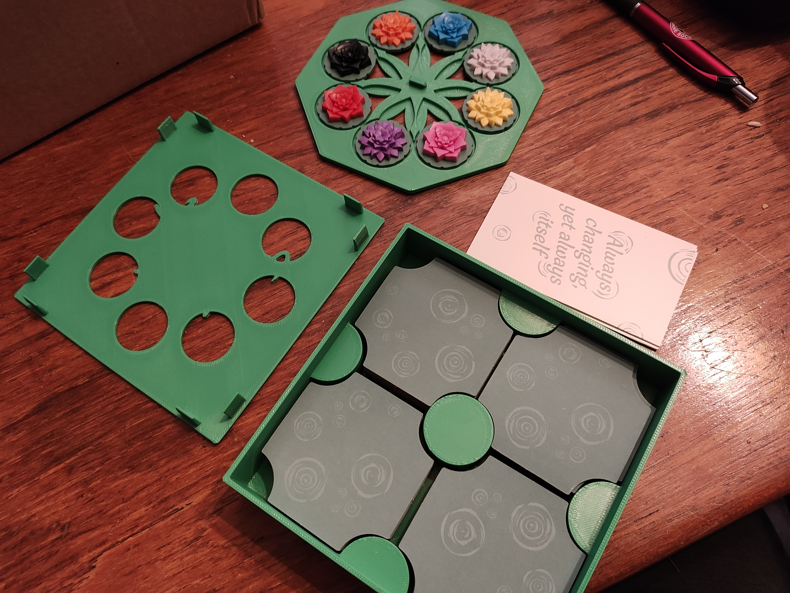

# Box for A Gentle Rain (Bloom Editions)

- [Box for A Gentle Rain (Bloom Editions)](#box-for-a-gentle-rain-bloom-editions)
  - [About](#about)
  - [Files](#files)
  - [Printing](#printing)
    - [Printing the Lid](#printing-the-lid)
  - [More pics](#more-pics)
- [Donations](#donations)
- [License](#license)
  - [Font](#font)

## About

This is just a new box for the Bloom edition of A Gentle Rain. Features a tray for the flower tokens which serves as both storage and display. Lid also includes cutouts to show off the flowers inside, mimicking the window in the original box.

Intended to be printed with multimaterial for the game name on the lid.

## Files

- [box.FCStd](./box.FCStd) - FreeCAD file for the box.
- [a-gentle-rain-box.zip](./a-gentle-rain-box.zip) - Four STLs for printing
  - [Box.stl](./Box.stl) - Main box file
  - Lid - Two files (see below for printing instructions!)
    - [Lid-Main.stl](./Lid-Main.stl)
    - [Lid-Text.stl](./Lid-Text.stl)
  - [TokenTray.stl](./TokenTray.stl) -

## Printing

Prints w/o supports. I printed in PETG, but should be fine in PLA.

### Printing the Lid

In OrcaSlicer (probably the same in BambuSlicer, I'd image), import both Lid-Main and Lid-Text at the same time, and in the dialog that pops up you want to import them as a single object with multiple parts.

Now you'll need to set the text material. Make sure you've added a second filament, then next to "Process" in the sidebar set the Global/Objects toggle to Objects.

Click on `Lid-Text.stl`, then press `2` to assign your second filament to it.

## More pics

# Donations

I don't do this for money. I do this for the joy of creation. No donations are necessary or expected.

That said, if you've enjoyed any of my designs or projects and would like to throw me a bone, here are a few options:

- Ko-fi: https://ko-fi.com/asmor
- Bitcoin: `3LAhwsanaWwcjdmzx2FnaLp7rTtgtSBvaG`
- Ethereum: `0x22794106e6D57c1b3A6C9Dd79DF5Ad3b54C9704a`

# License

[This work is licensed under CC BY-NC-SA 4.0](https://creativecommons.org/licenses/by-nc-sa/4.0/)

If you'd like to discuss commercial licensing of any of my designs, please send me a message.

## Font

Font is [Cozy by GORES Communitytype Studio](https://www.dafont.com/cozy.font), from dafont.com. See that page for license info.
