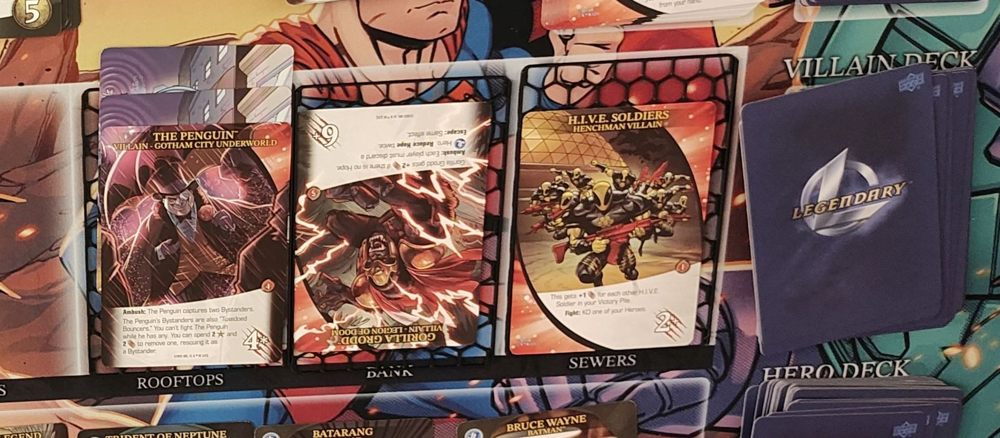
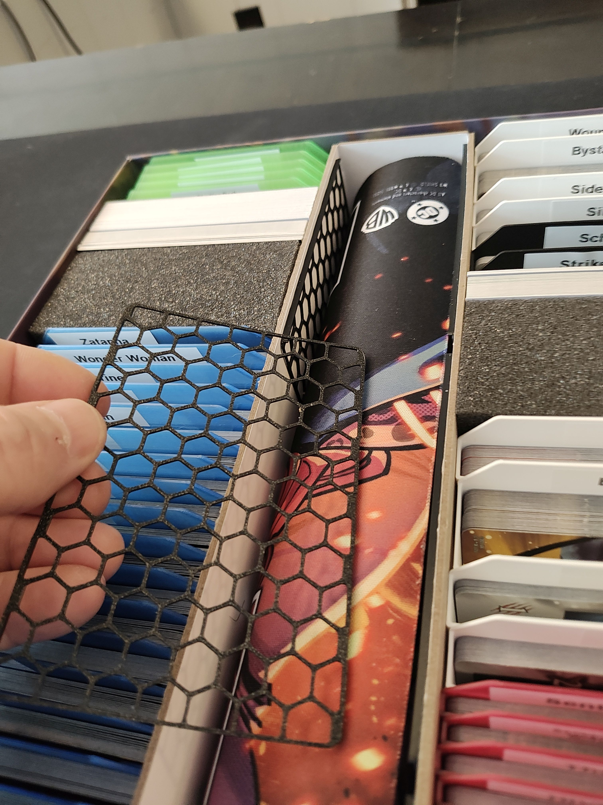
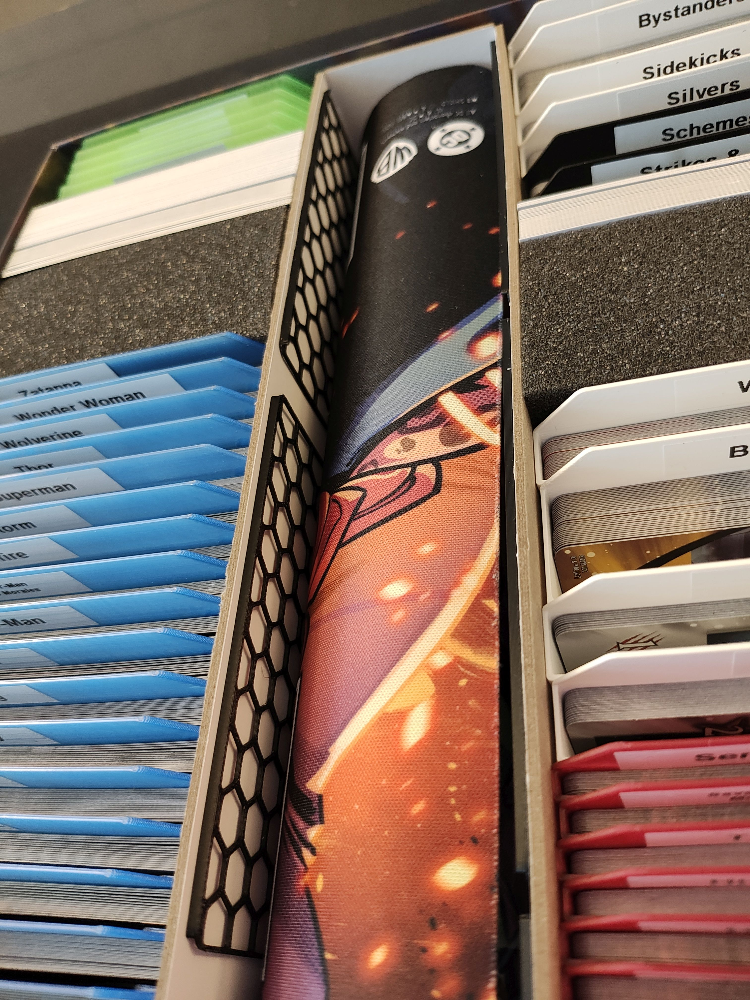

# Legendary City Track Slider

- [Legendary City Track Slider](#legendary-city-track-slider)
  - [About](#about)
  - [Files](#files)
  - [Printing](#printing)
  - [More pics](#more-pics)
- [Donations](#donations)
- [License](#license)

<video width="640" height="360" controls>
  <source src="./images/city-slider.mp4" type="video/mp4">
  Your browser does not support the video tag.
</video>

## About

Tiny little trays that sit on your city track and allow you to easily move the entire line down--including captured bystanders and other cards--to make room for new villains entering.

The trays have walls on the sides, but not on the top or bottom, allowing you to easily slide cards out or stack cards past the edge of the slider.

The sliders can be stored in the box alongside the mat (see [pictures below](#more-pics)).

## Files

- [city-track.FCStd](./city-track.FCStd) - FreeCAD file for the slider
- [city-track-slider.stl](./city-track-slider.stl) - STL ready to print

## Printing

Prints w/o supports. Note that this is _extremely_ thin, and take care removing it from the plate! Let the plate cooldown completely, and carefully work the sliders up around the edge.

I printed them in PETG, but you actually might be better off with PLA simply because it doesn't adhere to the bed as much.

## More pics

# Donations

I don't do this for money. I do this for the joy of creation. No donations are necessary or expected.

That said, if you've enjoyed any of my designs or projects and would like to throw me a bone, here are a few options:

- Ko-fi: https://ko-fi.com/asmor
- Bitcoin: `3LAhwsanaWwcjdmzx2FnaLp7rTtgtSBvaG`
- Ethereum: `0x22794106e6D57c1b3A6C9Dd79DF5Ad3b54C9704a`

# License

[This work is licensed under CC BY-NC-SA 4.0](https://creativecommons.org/licenses/by-nc-sa/4.0/)

If you'd like to discuss commercial licensing of any of my designs, please send me a message.
