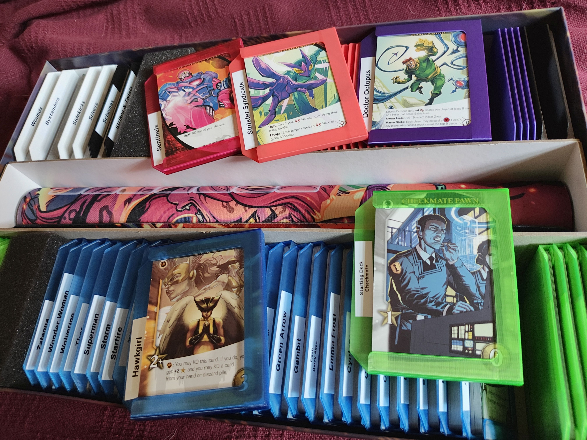
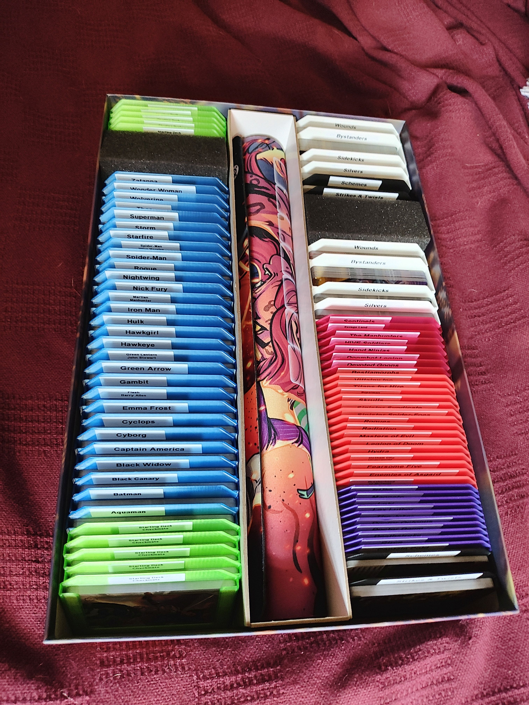
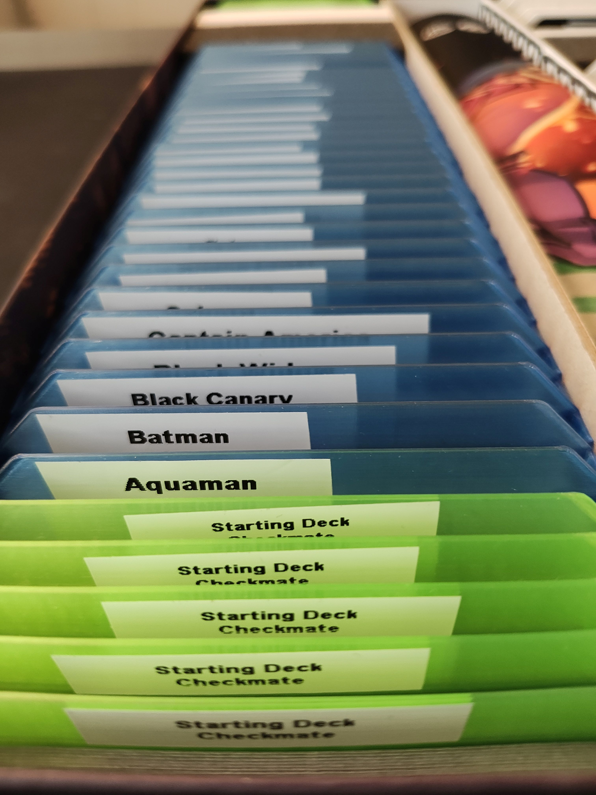
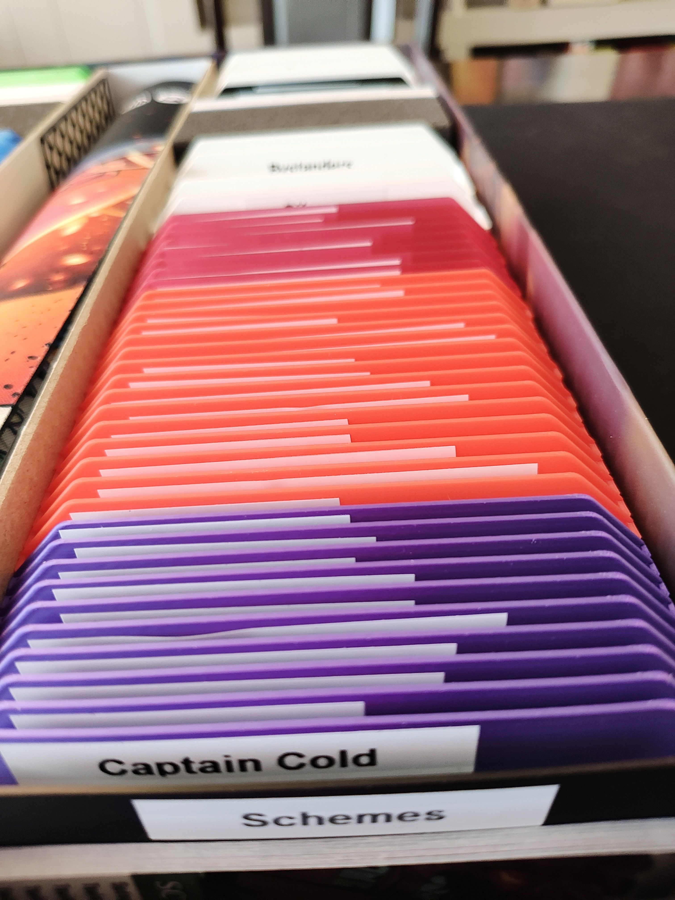
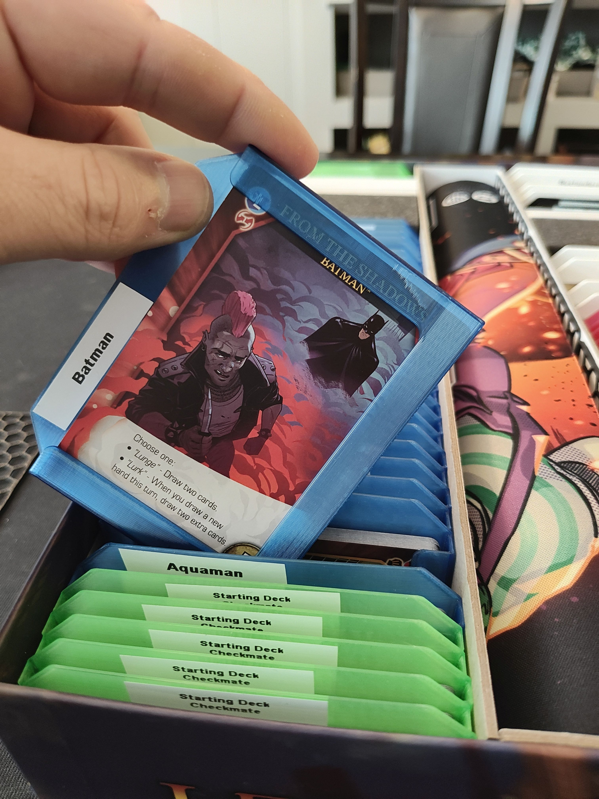
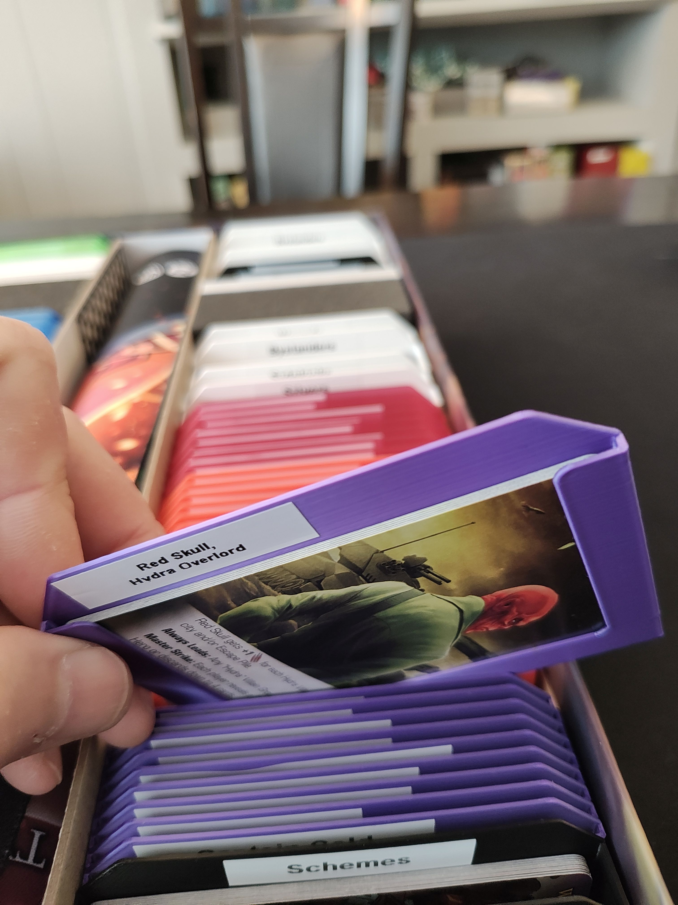

# Legendary Cards Storage

- [Legendary Cards Storage](#legendary-cards-storage)
  - [About](#about)
  - [Files](#files)
  - [Printing](#printing)
  - [More pics](#more-pics)
- [Donations](#donations)
- [License](#license)

## About

Small "sleeves" each designed to hold an entire set of legendary cards.

## Files

- [sleeves.FCStd](./sleeves.FCStd) - Parametric FreeCAD file where you can make new sleeves by defining the dimensions of your cards and card count.
- [sleeves.zip](./sleeves.zip) - Zip file containing STLs ready to print for the following card quantities:
  - [sleeve-5.stl](./sleeve-5.stl) - Masterminds
  - [sleeve-8.stl](./sleeve-8.stl) - Villain groups
  - [sleeve-10.stl](./sleeve-10.stl) - Henchmen groups
  - [sleeve-12.stl](./sleeve-12.stl) - Starting decks
  - [sleeve-16.stl](./sleeve-16.stl) - Master Strikes & Scheme Twists
  - [sleeve-20.stl](./sleeve-20.stl) - Hero decks (larger to account for heroes with transformed cards)
  - [sleeve-30.stl](./sleeve-30.stl) - Good size for lots of types of cards. Wounds, bystanders, etc.
  - [sleeve-60.stl](./sleeve-60.stl) - In case you've got a larger deck of cards (e.g. you're using a lot of special bystanders)

## Printing

Prints w/o supports. I printed in PETG, but should be fine in PLA.

## More pics

- 
- 
- 
- 
- 

# Donations

I don't do this for money. I do this for the joy of creation. No donations are necessary or expected.

That said, if you've enjoyed any of my designs or projects and would like to throw me a bone, here are a few options:

- Ko-fi: https://ko-fi.com/asmor
- Bitcoin: `3LAhwsanaWwcjdmzx2FnaLp7rTtgtSBvaG`
- Ethereum: `0x22794106e6D57c1b3A6C9Dd79DF5Ad3b54C9704a`

# License

[This work is licensed under CC BY-NC-SA 4.0](https://creativecommons.org/licenses/by-nc-sa/4.0/)

If you'd like to discuss commercial licensing of any of my designs, please send me a message.
