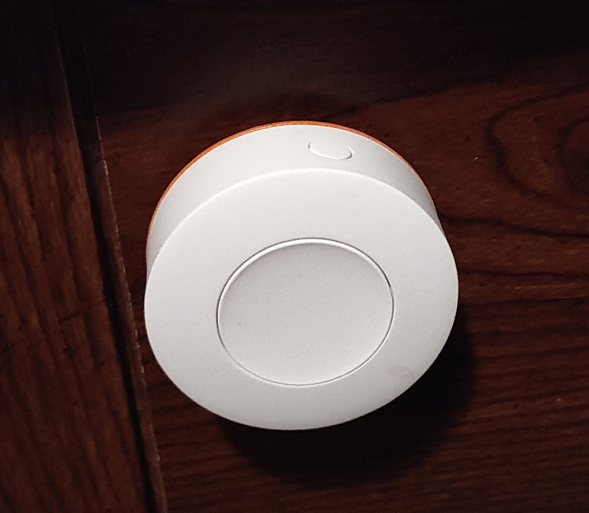

# Sonos Button Guard

- [Sonos Button Guard](#sonos-button-guard)
  - [About](#about)
  - [Files](#files)
  - [Printing](#printing)
- [Donations](#donations)
- [License](#license)

 

[Video demonstration](https://youtube.com/shorts/sIWc5Dv4iAQ)

## About

Sonos makes these great little ZigBee buttons with one fatal flaw: the back of
the buttons is chamfered and if you knock the button from the side it will
gleefully detach from the magnetic plate on the wall. One of my buttons is
placed kind of awkwardly behind a shelf so you need to hit it from the side and
I often end up knocking it.

This is a simple little ring that goes around the button and plate, preventing
accidental knocks while still allowing easy removal of the button for changing
batteries or other maintenance.

The specific model of button I'm using is the SNZB-01P. They seem to have
multiple ZigBee devices using this same form factor, so it probably works with
other things as well.

## Files

- [./button-guard-Body.stl](./button-guard-Body.stl) - STL ready to print
- [./button-guard.FCStd](./button-guard.FCStd) - Parametric FreeCAD file

## Printing

Prints w/o supports. I printed in PETG, but should be fine in PLA.

# Donations

I don't do this for money. I do this for the joy of creation. No donations are
necessary or expected.

That said, if you've enjoyed any of my designs or projects and would like to
throw me a bone, here are a few options:

- Ko-fi: https://ko-fi.com/asmor
- Bitcoin: `3LAhwsanaWwcjdmzx2FnaLp7rTtgtSBvaG`
- Ethereum: `0x22794106e6D57c1b3A6C9Dd79DF5Ad3b54C9704a`

# License

[This work is licensed under CC BY-NC-SA
4.0](https://creativecommons.org/licenses/by-nc-sa/4.0/)

If you'd like to discuss commercial licensing of any of my designs, please send
me a message.
