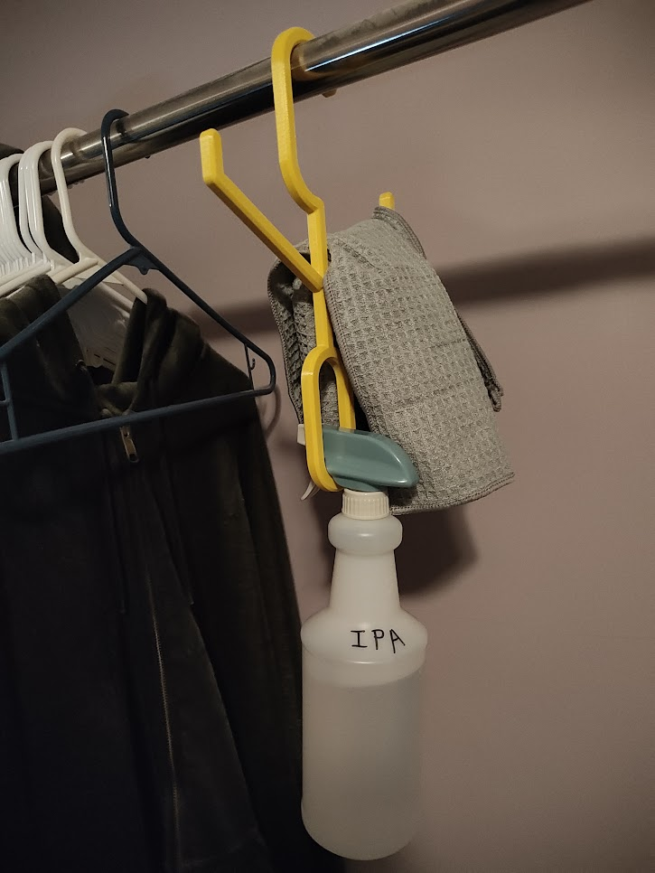

# Spray Bottle Hanger

- [Spray Bottle Hanger](#spray-bottle-hanger)
  - [About](#about)
  - [Files](#files)
  - [Printing](#printing)
- [Donations](#donations)
- [License](#license)

## About

Hanger for storing a spray bottle and a rag or two on a clothes rack.

## Files

- [./spray-bottle-hanger-Body.stl](./spray-bottle-hanger.stl) - STL ready to print
- [./spray-bottle-hanger.FCStd](./spray-bottle-hanger.FCStd) - Parametric FreeCAD file

## Printing

Prints w/o supports. I printed in PETG, but should be fine in PLA.

# Donations

I don't do this for money. I do this for the joy of creation. No donations are
necessary or expected.

That said, if you've enjoyed any of my designs or projects and would like to
throw me a bone, here are a few options:

- Ko-fi: https://ko-fi.com/asmor
- Bitcoin: `3LAhwsanaWwcjdmzx2FnaLp7rTtgtSBvaG`
- Ethereum: `0x22794106e6D57c1b3A6C9Dd79DF5Ad3b54C9704a`

# License

[This work is licensed under CC BY-NC-SA
4.0](https://creativecommons.org/licenses/by-nc-sa/4.0/)

If you'd like to discuss commercial licensing of any of my designs, please send
me a message.
